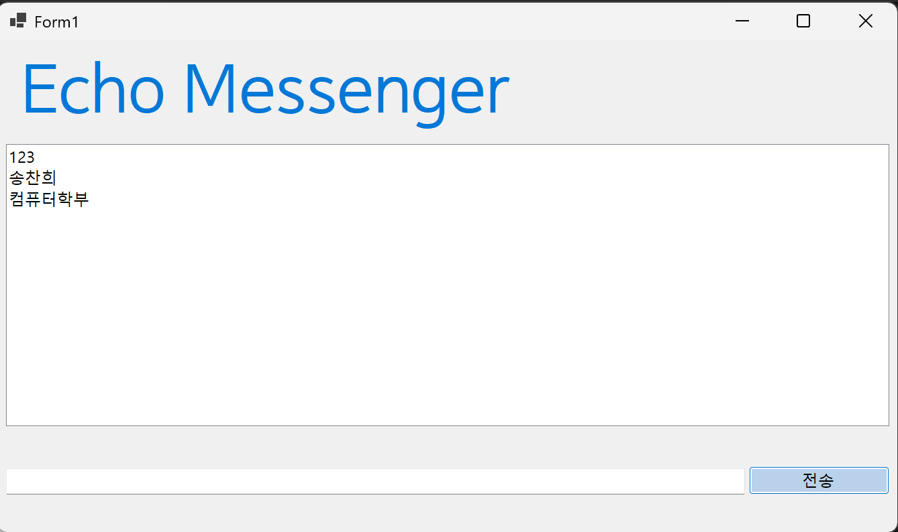
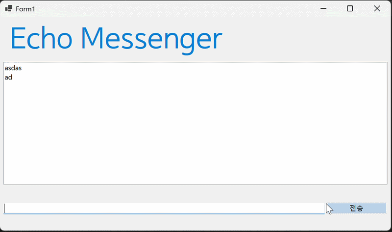

# (C# 코딩) 에코 메신저
## 개요
- C# 프로그래밍 학습
- 핵심기능: ...
- 화면구성: ...
## 실행 화면
- 1단계 코드의 실행 스크린샷
 - 2단계 코드의 실행 스크린샷
(여기에 이미지 삽입) - 3단계 코드의 실행 스크린샷
(여기에 이미지 삽입) - 4단계 코드의 실행 스크린샷
(여기에 이미지 삽입)
## 배운 내용
- 컨트롤의 좌표를 계산하는 것이 어려웠지만, ...
- 인터넷 연결은 Coilot의 도움을 받아 ... 

# (C# 코딩) 에코 메신저
## 개요
- C# 프로그래밍 학습
- 1줄 소개: 사용자 키보드 입력을 받아서 처리하는 프로그램
- 사용한 플랫폼: 
- C#, .NET Windows Forms, Visual Studio, GitHub
- 사용한 컨트롤:
- Label, TextBox, ListBox, Button
- 사용한 기술과 구현한 기능:
- Visual Studio를 이용하여 UI 디자인
- string 클래스를 이용한 사용자 입력 데이터 처리
- DateTime 클래스를 이용한 현재시간 정보 구하기
- 수업 중에 배우고 사용했던 클래스들 관련된 설명
-
-
- 실습 중에 구현한 기능들 설명
-
-

## 실행 화면 (과제1)
- 과제1 코드의 실행 스크린샷

- 과제 내용
	- UI 컴포넌트 배치: 사용자 인터페이스의 가독성을 위해 상단에는 프로그램 제목(lblTitle)을, 중앙에는 대화 내역 기록을 위한 lstChat(ListBox)을 배치했다. 하단에는 메시지 입력용 txtInput(TextBox)과 전송을 위한 btnSend(Button)를 정렬하여 메신저의 기본 구조를 완성했다.

	- 데이터 전송 로직 구현: 전송 버튼을 클릭했을 때 텍스트박스의 문자열 데이터를 리스트박스의 Items 컬렉션에 추가하는 이벤트 핸들러를 작성했다.

	- 입력 인터페이스 초기화: 메시지 전송이 완료된 후 사용자가 다음 대화를 즉시 입력할 수 있도록 Clear() 메서드를 사용하여 입력창을 깨끗이 비워주는 최적화 작업을 수행했다.
- 구현 내용과 기능 설명
	- 사용자가 txtInput에 메시지를 입력하고 btnSend 버튼을 누르면 해당 문자열이 lstChat 리스트박스 목록에 즉시 나타난다.
	
	- 버튼의 클릭 이벤트 핸들러 내부에서 lstChat.Items.Add() 메서드를 호출해 입력창의 텍스트를 리스트의 새 항목으로 등록했다.

	- 메시지 전송과 동시에 txtInput.Clear() 코드가 실행되어 입력창에 남아있던 기존 텍스트를 깨끗하게 지워준다.

	- 리스트박스의 가로/세로 범위를 넘어갈 정도로 메시지가 많아지면 자동으로 스크롤바가 생성되어 전체 내역을 확인할 수 있다.

	- 여러 번 반복해서 전송해도 리스트의 가장 아랫줄에 메시지가 순서대로 차곡차곡 쌓인다.

## 실행 화면 (과제2)
- 과제2 코드의 실행 스크린샷

- 과제 내용
	- 입력창 글자 지우기: 메시지를 전송하고 나면 입력창(txtInput)에 남아있는 이전 텍스트를 자동으로 삭제하도록 설정했다.

	- 커서 자동 이동(Focus): 메시지를 보낸 직후 마우스를 사용하지 않아도 바로 다음 메시지를 입력할 수 있게 커서를 입력창으로 다시 가져오도록 했다.

	- 엔터키 전송 기능: 마우스로 전송 버튼을 누르는 대신, 키보드에서 엔터(Enter) 키를 치는 것만으로도 메시지가 보내지게 만들었다.

	- 빈 메시지 차단: 아무 내용도 적지 않았거나 띄어쓰기만 한 상태에서 전송 버튼을 눌러도 메시지가 보내지지 않게 방어 기능을 추가했다.
- 구현 내용과 기능 설명
	- 메시지 전송 로직 끝부분에 txtInput.Clear() 코드를 실행하여 입력창에 남은 글자를 깨끗하게 지워주는 기능을 확인했다.

	- 이어서 txtInput.Focus() 메서드를 호출해 전송 버튼을 누르자마자 입력창에서 바로 다음 타이핑을 이어갈 수 있는 상태를 만들었다.

	- 입력창의 KeyDown 이벤트 핸들러에서 사용자가 누른 키가 Keys.Enter인지 확인하고, 맞다면 전송 버튼(btnSend)이 눌리도록 코드를 연결했다.

	- 전송 로직 시작 부분에 string.IsNullOrWhiteSpace() 조건을 넣어, 알맹이 없는 빈 줄이 대화창 리스트에 추가되는 것을 원천적으로 막았다.

결과적으로 마우스 없이 키보드만으로도 끊김 없이 대화를 주고받을 수 있는 편리한 채팅 환경을 구현했다.
## 실행 화면 (과제3)
- 과제3 코드의 실행 스크린샷

- 과제 내용
- Label(표시), TextBox(입력), Button(전송), ListBox(대화창)를 적절히 배치합니다.
- 전송 버튼 클릭 시 TextBox의 텍스트를 ListBox의 항목(Items)으로 추가합니다.
- 추가 직후 TextBox의 내용을 비워(Clear) 다음 입력을 준비합니다.
- 구현 내용과 기능 설명
- 입력창에 메시지 입력하고 전송 버튼을 누르면 메시지가 리스트 박스에 표시된다.
- 계속 반복하면 메시지가 리스트 박스에 한 줄씩 계속 추가된다.
- 추가 내용이 많아지면 리스트 박스에 스크롤바가 자동으로 생기고 스크롤된다.

## 실행 화면 (과제4)
- 과제4 코드의 실행 스크린샷

- 과제 내용
- Label(표시), TextBox(입력), Button(전송), ListBox(대화창)를 적절히 배치합니다.
- 전송 버튼 클릭 시 TextBox의 텍스트를 ListBox의 항목(Items)으로 추가합니다.
- 추가 직후 TextBox의 내용을 비워(Clear) 다음 입력을 준비합니다.
- 구현 내용과 기능 설명
- 입력창에 메시지 입력하고 전송 버튼을 누르면 메시지가 리스트 박스에 표시된다.
- 계속 반복하면 메시지가 리스트 박스에 한 줄씩 계속 추가된다.
- 추가 내용이 많아지면 리스트 박스에 스크롤바가 자동으로 생기고 스크롤된다.