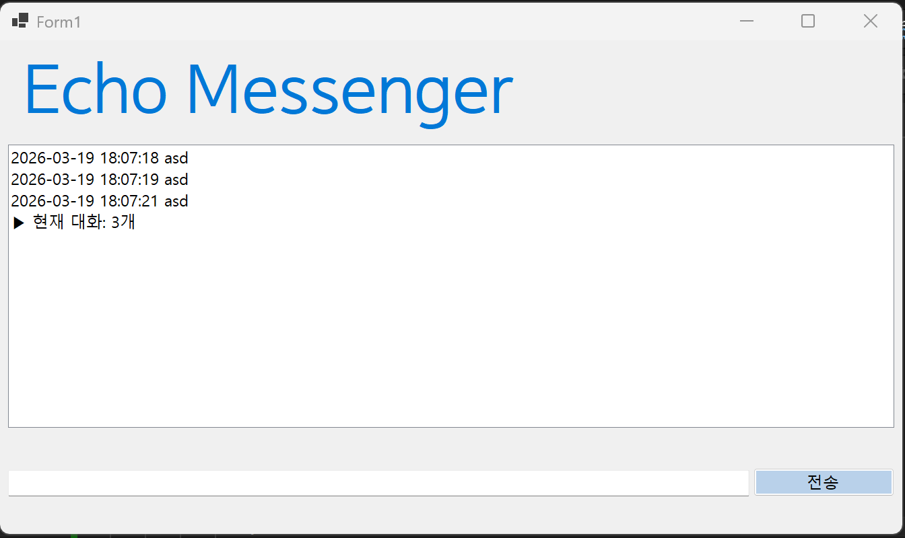
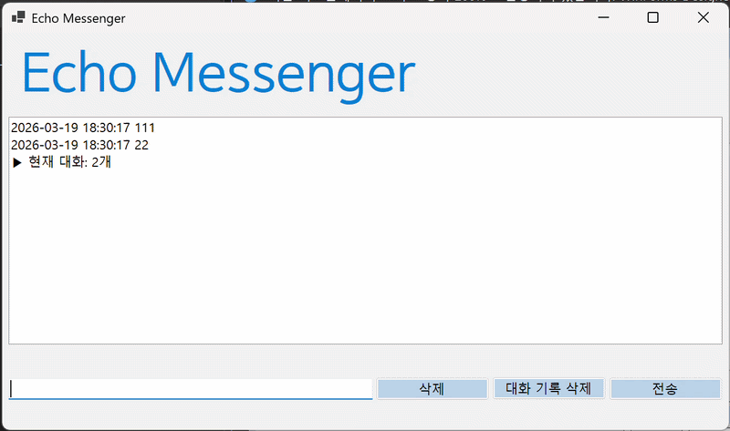
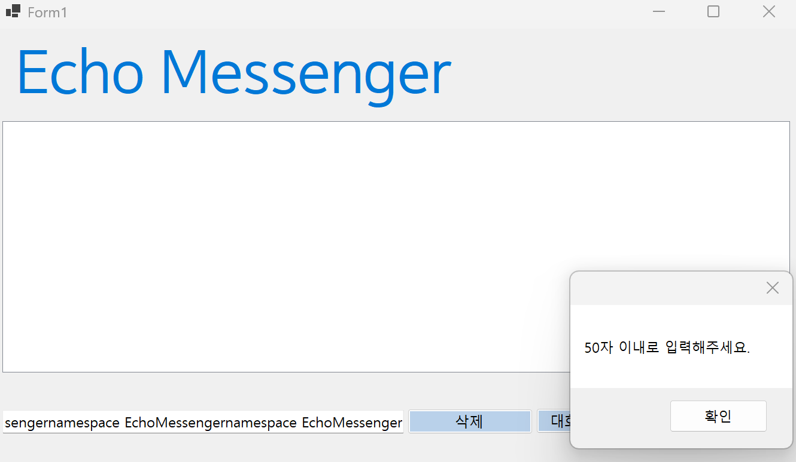

# (C# 코딩) 에코 메신저

## 개요
- C# 프로그래밍 학습
- 1줄 소개: 사용자가 키보드로 입력한 내용을 실시간으로 리스트 박스에 출력하고 관리하는 프로그램이다.
- 사용한 플랫폼:
  - C#, .NET Windows Forms, Visual Studio, GitHub
- 사용한 컨트롤:
  - Label, TextBox, ListBox, Button: 프로그램의 제목과 상태를 표시하고, 사용자의 메시지를 입력받아 목록으로 출력하며 전송 및 삭제 기능을 수행한다.
- 사용한 기술과 구현한 기능:
  - Visual Studio를 이용하여 UI 디자인: 도구 상자에서 필요한 컨트롤을 배치하고 속성창을 통해 이름과 디자인을 설정하여 메신저 형태의 인터페이스를 완성했다.
  - string 클래스를 이용한 사용자 입력 데이터 처리: IsNullOrWhiteSpace() 함수를 사용해 의미 없는 공백 전송을 차단하고, Length 속성으로 입력값의 길이를 체크하여 시스템 오류를 방지했다.
  - DateTime 클래스를 이용한 현재시간 정보 구하기: Now 속성을 활용하여 메시지가 리스트에 추가되는 시점의 날짜와 시각을 데이터로 불러와 기록에 남겼다.

- 수업 중에 배우고 사용했던 클래스들 관련된 설명
  - ListBox.ObjectCollection: 리스트 박스 내부의 항목들을 주머니처럼 담아두는 클래스다. Items 속성을 통해 새로운 메시지를 추가하거나, Index 번호를 추적하여 특정 위치의 데이터를 삭제하는 데 사용했다.
  - MessageBox: 프로그램 실행 중 예외 상황이 발생하거나 경고가 필요할 때 사용자에게 알림창을 보여준다. 50자 초과 입력이나 항목 미선택 삭제 시 안내 메시지를 띄워 올바른 조작을 유도했다.
  - KeyEventArgs: 키보드의 눌림 상태를 감지하는 클래스다. KeyCode 속성을 사용해 사용자가 엔터(Enter) 키를 눌렀는지 확인하고, 마우스 클릭 없이도 전송 기능이 실행되도록 연결했다.
  - Form 클래스: 프로그램의 전체적인 윈도우 창을 구성하며, 컨트롤 배치와 이벤트 핸들러가 작동하는 기본 바탕이 된다.

- 실습 중에 구현한 기능들 설명
  - 실시간 대화 카운팅 및 자동 업데이트: 메시지를 전송하거나 삭제할 때마다 현재 목록에 쌓인 메시지 개수를 계산하여 표시했다. 새로운 메시지가 추가될 때 이전의 개수 표시 줄은 지우고 최신 숫자로 갱신하여 중복 없이 마지막 줄에만 정보가 남도록 했다.
  - 예외 처리 기반의 선택 항목 삭제: 리스트 박스에서 특정 줄을 마우스로 선택한 후 삭제 버튼을 누르면 해당 항목만 지워지게 했다. 만약 아무것도 선택하지 않은 상태(SelectedIndex가 -1인 경우)라면 경고창을 띄워 프로그램이 갑자기 꺼지는 현상을 막았다.
  - 입력창 자동 최적화 시스템: 메시지 전송 버튼을 누르는 즉시 Clear() 함수로 입력창을 깨끗이 비우고, Focus() 함수를 통해 마우스 조작 없이 바로 다음 문장을 칠 수 있도록 커서를 위치시켰다.
  - 전체 기록 초기화 기능: '대화 기록 삭제' 버튼을 클릭하면 리스트 박스에 담긴 모든 이력을 한 번에 제거하고 프로그램 타이틀과 상태 정보를 초기화하여 처음 상태로 되돌렸다.
  - 글자 수 제한 유효성 검사: 입력창에 쓸 수 있는 최대 글자 수를 50자로 제한했다. 만약 사용자가 너무 긴 문장을 입력하면 전송을 차단하고 팝업창을 통해 안내함으로써 데이터의 일관성을 유지했다.

## 실행 화면 (과제1)
- 과제1 코드의 실행 스크린샷

- 과제 내용
	- UI 컴포넌트 배치: 사용자 인터페이스의 가독성을 위해 상단에는 프로그램 제목(lblTitle)을, 중앙에는 대화 내역 기록을 위한 lstChat(ListBox)을 배치했다. 하단에는 메시지 입력용 txtInput(TextBox)과 전송을 위한 btnSend(Button)를 정렬하여 메신저의 기본 구조를 완성했다.

	- 데이터 전송 로직 구현: 전송 버튼을 클릭했을 때 텍스트박스의 문자열 데이터를 리스트박스의 Items 컬렉션에 추가하는 이벤트 핸들러를 작성했다.

	- 입력 인터페이스 초기화: 메시지 전송이 완료된 후 사용자가 다음 대화를 즉시 입력할 수 있도록 Clear() 메서드를 사용하여 입력창을 깨끗이 비워주는 최적화 작업을 수행했다.
- 구현 내용과 기능 설명
	- 사용자가 txtInput에 메시지를 입력하고 btnSend 버튼을 누르면 해당 문자열이 lstChat 리스트박스 목록에 즉시 나타난다.
	
	- 버튼의 클릭 이벤트 핸들러 내부에서 lstChat.Items.Add() 메서드를 호출해 입력창의 텍스트를 리스트의 새 항목으로 등록했다.

	- 메시지 전송과 동시에 txtInput.Clear() 코드가 실행되어 입력창에 남아있던 기존 텍스트를 깨끗하게 지워준다.

	- 리스트박스의 가로/세로 범위를 넘어갈 정도로 메시지가 많아지면 자동으로 스크롤바가 생성되어 전체 내역을 확인할 수 있다.

	- 여러 번 반복해서 전송해도 리스트의 가장 아랫줄에 메시지가 순서대로 차곡차곡 쌓인다.

## 실행 화면 (과제2)
- 과제2 코드의 실행 스크린샷

- 과제 내용
	- 입력창 글자 지우기: 메시지를 전송하고 나면 입력창(txtInput)에 남아있는 이전 텍스트를 자동으로 삭제하도록 설정했다.

	- 커서 자동 이동(Focus): 메시지를 보낸 직후 마우스를 사용하지 않아도 바로 다음 메시지를 입력할 수 있게 커서를 입력창으로 다시 가져오도록 했다.

	- 엔터키 전송 기능: 마우스로 전송 버튼을 누르는 대신, 키보드에서 엔터(Enter) 키를 치는 것만으로도 메시지가 보내지게 만들었다.

	- 빈 메시지 차단: 아무 내용도 적지 않았거나 띄어쓰기만 한 상태에서 전송 버튼을 눌러도 메시지가 보내지지 않게 방어 기능을 추가했다.
- 구현 내용과 기능 설명
	- 메시지 전송 로직 끝부분에 txtInput.Clear() 코드를 실행하여 입력창에 남은 글자를 깨끗하게 지워주는 기능을 확인했다.

	- 이어서 txtInput.Focus() 메서드를 호출해 전송 버튼을 누르자마자 입력창에서 바로 다음 타이핑을 이어갈 수 있는 상태를 만들었다.

	- 입력창의 KeyDown 이벤트 핸들러에서 사용자가 누른 키가 Keys.Enter인지 확인하고, 맞다면 전송 버튼(btnSend)이 눌리도록 코드를 연결했다.

	- 전송 로직 시작 부분에 string.IsNullOrWhiteSpace() 조건을 넣어, 알맹이 없는 빈 줄이 대화창 리스트에 추가되는 것을 원천적으로 막았다.

결과적으로 마우스 없이 키보드만으로도 끊김 없이 대화를 주고받을 수 있는 편리한 채팅 환경을 구현했다.
## 실행 화면 (과제3)
- 과제3 코드의 실행 스크린샷

- 과제 내용
	- 타임스탬프: 메시지마다 현재 시간을 yyyy-MM-dd HH:mm:ss 형식으로 기록한다.

	- 상태 표시: 리스트박스(lstChat) 최하단에 현재 대화 개수를 표시하며, 새 메시지가 오면 기존 개수 줄을 삭제하고 갱신한다.

	- 데이터 정제: Trim()으로 불필요한 공백을 제거한다.
- 구현 내용과 기능 설명
	- lstChat.Items.RemoveAt 로직을 활용해 대화 개수 표시가 리스트 내에 중복으로 쌓이지 않고 항상 마지막 줄에만 나타나도록 최적화했다.

	- 전송 시각 정보가 사진 포맷과 동일하게 출력되는 것을 검증했다.

	- 공백만 있는 무의미한 데이터 전송을 차단하여 데이터의 무결성을 확보했다.

## 실행 화면 (과제4)
- 과제4 코드의 실행 스크린샷

- 과제 내용
	- Label(표시), TextBox(입력), Button(전송), ListBox(대화창)를 적절히 배치한다.
    - 전송 버튼 클릭 시 TextBox의 텍스트를 ListBox의 항목(Items)으로 추가한다.
    - 추가 직후 TextBox의 내용을 비워(Clear) 다음 입력을 준비한다.
    - 선택 항목 삭제: ListBox에서 특정 메시지를 마우스로 클릭하고 '삭제' 버튼을 누르면 해당 항목만 목록에서 제거한다. (단, 선택하지 않고 삭제 시 발생하는 에러를 예외 처리함)
    - 전체 초기화: '대화 기록 삭제' 버튼을 클릭하면 리스트의 모든 내용을 한 번에 지운다.
    - 글자 수 제한: 입력창에 글자 수를 50자로 제한하고, 초과 시 사용자에게 경고 메시지를 띄우거나 전송을 차단한.
- 구현 내용과 기능 설명
    - 입력창에 메시지 입력하고 전송 버튼을 누르면 메시지가 리스트 박스에 표시된다.
    - 계속 반복하면 메시지가 리스트 박스에 한 줄씩 계속 추가된다.
    - 추가 내용이 많아지면 리스트 박스에 스크롤바가 자동으로 생기고 스크롤된다.
    - 타임스탬프 기능: DateTime.Now를 활용해 메시지 전송 시 yyyy-MM-dd HH:mm:ss 형식의 시간이 메시지 앞에 자동으로 붙도록 구현.
    - 실시간 대화 개수 갱신: 메시지가 추가되거나 삭제될 때마다 리스트박스 최하단에 ▶ 현재 대화: N개 문구가 실시간으로 갱신되어 대화 흐름을 방해하지 않도록 처리.
    - 예외 처리 및 유효성 검사: SelectedIndex가 -1인 경우(항목 미선택)에 대한 방어 코드를 작성하여 프로그램의 비정상 종료를 방지하고, 50자 이상의 입력에 대해 MessageBox 피드백을 제공.
    - 단축키 연동: KeyDown 이벤트를 통해 엔터(Enter) 키 입력 시 전송 버튼이 클릭되도록 구현하여 사용자 편의성 상승.